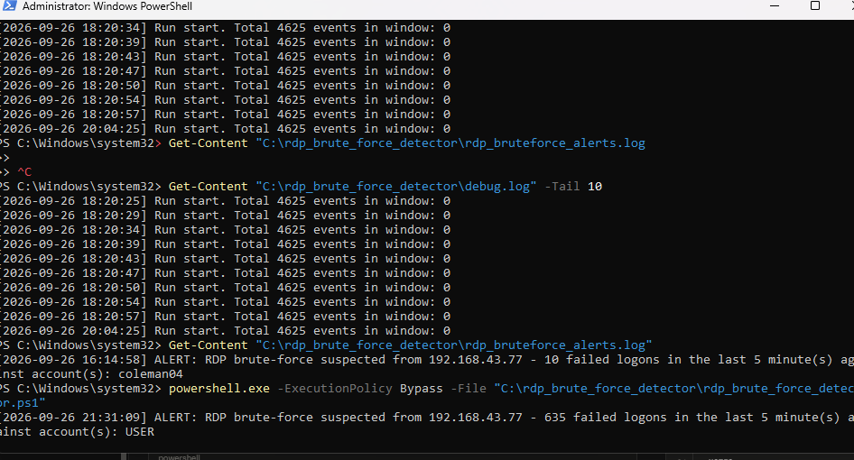
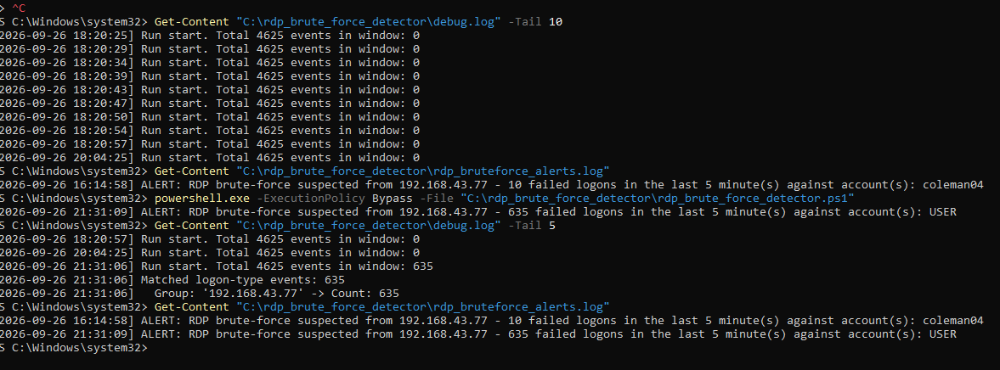
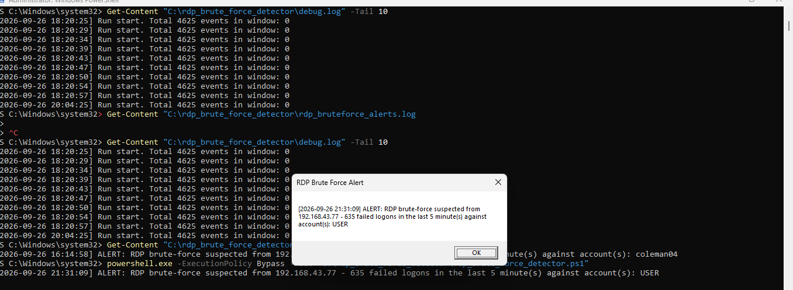

# RDP Brute Force Detection Lab - Detection Engineering Phase

**Analyst:** Coleman04
**Builds on:** original RDP Brute Force Detection Lab (Kali -> Windows RDP attack + Security log investigation)
**Challenge set by:** senior reviewer - turn the lab from "log analysis" into a working, tested, tuned detection.
**Stack used:** no SIEM required - Windows Event Viewer + Task Scheduler + PowerShell + a Sigma rule for portability.

---

## 1. Hypothesis

I expect to detect an RDP brute-force attack by identifying multiple failed logon
attempts (Event ID 4625) from the same source IP within a short time window
(5+ failures in 5 minutes).

Original hypothesis assumed all RDP brute-force failures would log as **Logon Type
10 (RemoteInteractive)**. Real testing (see Section 5) showed this assumption was
incomplete - the detection was revised to also cover **Logon Type 3 (Network)**,
since that's how a common attack tool's failed attempts actually appear in the log.

## 2. Telemetry

- **Source:** Windows Security Event Log
- **Event ID:** 4625 (An account failed to log on)
- **Key fields:** TargetUserName, IpAddress (source), LogonType (10 and 3), TimeCreated
- **Confirmed logging is enabled** on the victim VM before building the detection by
  manually triggering a failed RDP logon and verifying it appeared in Event Viewer.


## 3. Detection Logic

Two forms of the same rule, kept in sync:

- **`rules/rdp_brute_force.yml`** - Sigma rule version, written in the modern
  correlation-rule format (a base rule + a correlation rule referencing it, since
  the older `condition: selection | count(...)` pipe syntax is deprecated and
  pySigma rejects it). Validated clean with `sigma check` (0 errors, 0 issues).
  Portable; can be converted to a real SIEM query later
  (`sigma convert -t splunk -p windows rules/rdp_brute_force.yml`) once Splunk is
  running.
- **`rdp_brute_force_detector.ps1`** - PowerShell version, used for actually testing
  on this lab since Splunk isn't available yet (RAM constraint on the homelab host).
  Groups failed RDP logons by source IP over a rolling window and alerts when the
  threshold is met. Includes temporary debug logging (`debug.log`) added during
  troubleshooting to show exactly what each run finds - kept in for now as evidence
  of the debugging process; can be stripped out for a "clean" production version.


### How the PowerShell detector is wired up (no SIEM needed)

1. Open **Event Viewer** -> Windows Logs -> Security.
2. **Create a Custom View** filtered to Event ID 4625.


3. Right-click the Custom View -> **"Attach a Task to This Custom View."**
4. Set the task action to run PowerShell with:
   - Program/script: `powershell.exe`
   - Arguments: `-ExecutionPolicy Bypass -File "C:\rdp_brute_force_detector\rdp_brute_force_detector.ps1"`
5. Configure the task to run as **SYSTEM** with **highest privileges** (see Section 5
   - this was required, not optional).
6. Now every time a 4625 event lands, Task Scheduler runs the script, which checks
   whether the failure count from that source IP crosses the threshold in the
   configured time window, and logs/pops an alert if it does.

This gets you a real, automatically-triggered detection using only what's built into
Windows - useful to call out explicitly in the writeup, since it shows the detection
logic works independent of any specific SIEM product.

## 4. Test

**Attack tool:** Hydra v9.5 (RDP module, experimental), later confirmed by direct
`xfreerdp` testing for controlled single-attempt validation.
**Target:** Windows victim VM, `192.168.43.77:3389`.
**Attacker:** Kali VM on the same lab network.
**Final successful test run:** 2026-09-26, 21:31 - Hydra run against the real local
account `USER` (see "what went wrong" below for why this mattered), generating a
sustained burst of failed logon attempts.


## 5. Results - What Actually Happened (and everything that had to be fixed first)

The detection did **not** work on the first attempt, or the second, or several after
that. Getting to a working end-to-end result required debugging a chain of separate,
real issues, each confirmed with evidence before moving to the next:

**1. Wrong Logon Type assumption.** The original detection only matched Logon Type
10. Manually testing a failed RDP logon with `xfreerdp` showed the type actually
logged depends on the client's security negotiation: `xfreerdp` with default/NLA
settings produced **Logon Type 3**, while `xfreerdp /sec:tls` produced **Logon Type
10**. Hydra's attempts also logged as Type 3. **Fix:** broadened both the Sigma rule
and the PowerShell script to match Logon Type 3 OR 10, with the trade-off (Type 3 is
broader, covers non-RDP network logons too) documented directly in both files'
falsepositive notes.

**2. Outdated Sigma condition syntax.** The original Sigma rule used
`condition: selection | count(...) by ... > 5`, which `sigma check` rejected as
deprecated. **Fix:** rewrote it as a proper two-part rule (a base rule + a
`correlation` block referencing it), which validated clean.

**3. Wrong target username.** A large portion of early Hydra runs targeted a
username (`coleman04`) that didn't actually exist as a local account on the Windows
VM (`net user coleman04` returned "user name could not be found"). This meant many
early "failed" test runs weren't testing anything realistic. **Fix:** confirmed the
real local accounts with `net user`, and re-ran attacks against the actual account
(`USER`).

An earlier trigger, from before this fix, still shows the alert format working
correctly against the wrong account - useful as evidence the detection logic itself
was already sound before the test target was corrected. The terminal session below
shows both entries side by side: the early alert against `coleman04`, and the later
one against the corrected `USER` account after the fix:




**4. Account lockout.** Windows' default lockout policy (`Lockout threshold: 10`)
locked the target account after only 10 failed attempts (confirmed via Event ID
4740, "account was locked out"), which cut Hydra's bursts short and made later
attempts fail outright. **Fix (lab-only):** temporarily set
`net accounts /lockoutthreshold:0` to allow sustained testing; documented that this
is a deliberate lab-only change and would not be appropriate on a production system.

**5. Task Scheduler silently stopped triggering under load.** After the account and
Sigma issues were fixed, the debug log still showed zero events being found on every
automated run, despite hundreds of confirmed matching events sitting in the Security
log. Investigation via Task Scheduler's History tab and Last Run Result showed:
   - The task needed **"Run with highest privileges"** and to run as the **SYSTEM**
     account specifically, since reading the Security log requires elevated rights
     that a standard user-context task doesn't automatically have.
   - Running as SYSTEM then failed under the *default* execution policy scope
     (SYSTEM has its own separate policy state from the interactive user), fixed by
     adding `-ExecutionPolicy Bypass` directly to the task's arguments.
   - Even after both fixes, the task stopped firing again after a sustained few
     hundred rapid triggers, most likely due to Task Scheduler's default
     "Do not start a new instance" setting silently dropping overlapping trigger
     requests during a fast burst. Changed to "Queue a new instance," and
     disabled/re-enabled the task to force it to re-register its event subscription.
   - **This was only partially resolved** - full automated triggering was
     confirmed working for extended periods, but became unreliable again under
     very heavy sustained bursts (600+ events in a short window). This is an
     honest limitation of this implementation, not a claim that it's fully solved.


**6. Final proof (manual execution, immediately after a fresh attack):**
```
[2026-09-26 21:31:06] Run start. Total 4625 events in window: 635
[2026-09-26 21:31:06] Matched logon-type events: 635
[2026-09-26 21:31:06]   Group: '192.168.43.77' -> Count: 635
[2026-09-26 21:31:09] ALERT: RDP brute-force suspected from 192.168.43.77 -
635 failed logons in the last 5 minute(s) against account(s): USER
```





This confirms the full detection chain works correctly end-to-end: Windows logs the
failures, the script correctly reads them, filters to the right logon types, groups
them accurately by source IP (no formatting mismatch), checks them against the
threshold, and produces an accurate, correctly-attributed alert - both to the log
file and as a live popup.

## 6. Tuning Changes Made

Three real tuning changes came out of this testing, each with a documented trade-off:

1. **Widened `LogonType` filter from `[10]` to `[10, 3]`.** Trade-off: Type 3 is a
   broader category (covers non-RDP network logons too), so in a real
   multi-service environment this would need an additional filter (e.g.
   destination port 3389) to stay precise. Accepted here because this lab host's
   only exposed service is RDP.
2. **Time window kept at 5 minutes** (raised from an initial 2-minute draft).
   Trade-off: catches a slower, more patient brute-force attempt, at the cost of
   tolerating slightly more noise before alerting.
3. **Task Scheduler "if already running" setting changed from "Do not start a new
   instance" to "Queue a new instance."** Trade-off: prevents silently dropped
   triggers during a fast burst, at the cost of potentially queuing up a backlog
   of runs if the script is ever slow - acceptable for this lab's scale.

## 7. Files in This Repo

- `rules/rdp_brute_force.yml` - Sigma rule (base rule + correlation rule), validated
  clean with `sigma check`, matches Logon Type 10 or 3.
- `rdp_brute_force_detector.ps1` - PowerShell detector, wired to Event Viewer via
  Task Scheduler (SYSTEM account, highest privileges, execution policy bypass).
  Includes temporary debug logging used to diagnose the Task Scheduler issue above.
- `README.md` - this write-up.

## 8. Reflection

**What did we do?**
Turned the original RDP lab from a manual log-review exercise into an actual working
detection: a PowerShell script and a matching Sigma rule that both watch for
clustered failed RDP logons by source IP, wired into Task Scheduler so the
PowerShell version triggers automatically off the real Windows Security log instead
of running on a timer.

**What did I find?**
The detection logic itself worked the whole time - what didn't work, one at a time,
was almost everything around it: the logon type assumption was incomplete, the
Sigma syntax was outdated, the test account didn't exist, the lockout policy cut
attacks short, and Task Scheduler needed specific privilege and instance settings to
keep triggering reliably under load.

**What did I learn?**
That "detection engineering" is mostly the plumbing around the detection, not the
detection itself. The count-by-source-IP logic was correct from the start; every fix
after that was about getting real data to actually reach it - the right account, the
right logon types, the right permissions, and a scheduler setting that wouldn't
silently drop events during a burst.

**What would I have done differently next time?**
Confirm the target account exists and check the lockout policy *before* running any
attack traffic, since both wasted early test cycles on data that was never going to
prove anything. I'd also stress-test Task Scheduler's triggering under a heavy burst
from the start, rather than discovering the "Do not start a new instance" issue only
after it had already dropped real detections - and I'd treat the sustained
600+-event failure case as an open item to revisit, not something to leave
unresolved in a final writeup.

---

*Honest note for anyone reading this as a portfolio piece: getting this from "script
runs manually" to "fully automated, always-on detection" surfaced five separate real
issues (wrong logon type assumption, deprecated Sigma syntax, a nonexistent test
account, account lockout, and a Task Scheduler reliability limit under heavy load).
The detection logic itself is proven correct. The automation layer works reliably
under normal conditions but has a documented limitation under very heavy sustained
bursts - which is itself a realistic finding about the limits of a lightweight,
no-SIEM detection setup.*

---

**Author:** Coleman04 | Stephen Okegbade
